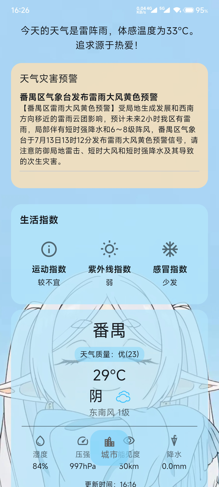
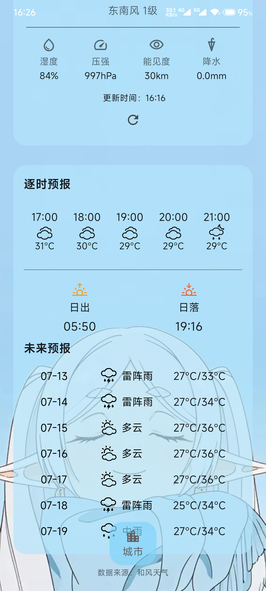

# wea - 简洁天气 App 🌤️

一款使用 Flutter 构建的、界面简洁美观的跨平台天气应用。它允许用户搜索城市，并展示该城市的实时天气状况。

## 🚀 主要功能

* **实时天气**：展示指定城市的实时温度、天气状况、风向和风力。
* **精美UI**：采用背景图 + 毛玻璃（Glassmorphism）效果，界面现代美观。
* **城市搜索**：支持中英文输入，动态搜索城市列表。
* **数据持久化**：自动保存用户上次选择的城市，下次打开时直接加载。
* **响应式布局**：UI元素尺寸能根据屏幕大小自适应。
* **动态图标**：根据天气状况码，动态加载对应的SVG天气图标。

## 📸 预览

<p align="center">
  &emsp;
  &emsp;
  
</p>

## 🛠️ 与核心库

* **SVG支持**：[`flutter_svg`](https://pub.dev/packages/flutter_svg) - 用于加载和渲染矢量的天气图标。
* **数据来源**：[和风天气 (QWeather)](https://dev.qweather.com/) - 提供免费的天气数据API。

## 📦 如何运行

1.  **克隆仓库**
    ```bash
    git clone [https://github.com/SunWithCat/wea.git](https://github.com/SunWithCat/wea.git) cd wea
    ```

2.  **获取依赖**
    ```bash
    flutter pub get
    ```

# API 配置说明

## 概述

本项目使用了环境配置文件来管理API密钥和其他敏感信息，以避免将这些信息直接提交到版本控制系统（如GitHub）中。

## 设置步骤

1. 在项目根目录中，你会找到一个名为 `lib/config.example.dart` 的文件，这是配置文件的模板。

2. 复制此文件并重命名为 `lib/config.dart`：
   ```bash
   cp lib/config.example.dart lib/config.dart
   ```

3. 编辑 `lib/config.dart` 文件，将示例API密钥替换为你的实际API密钥：
   ```dart
   static const String apiKey = 'your_actual_api_key_here';
   ```

4. 保存文件。应用程序现在将使用你的API密钥。
